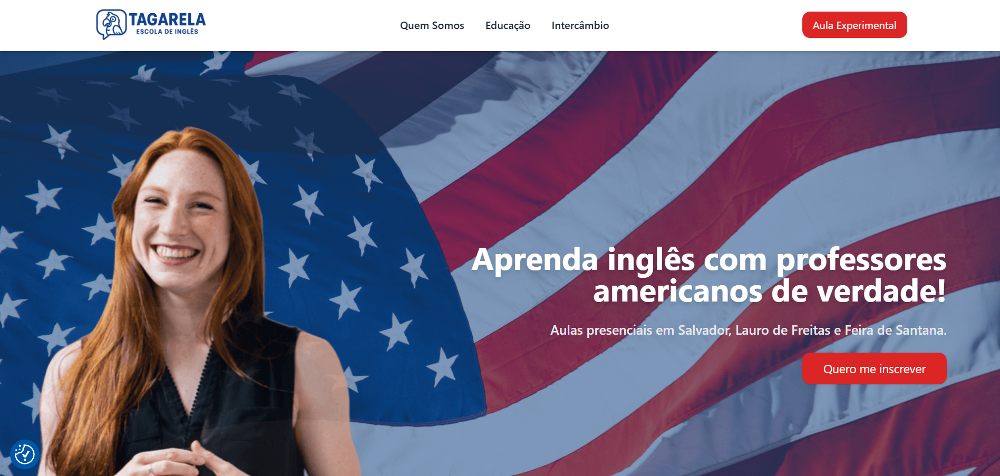
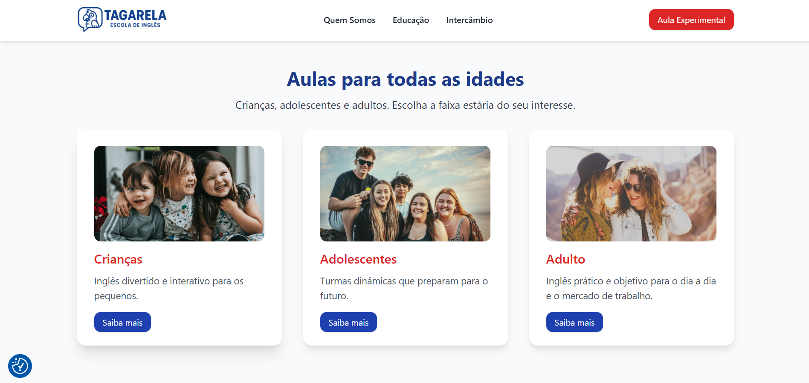
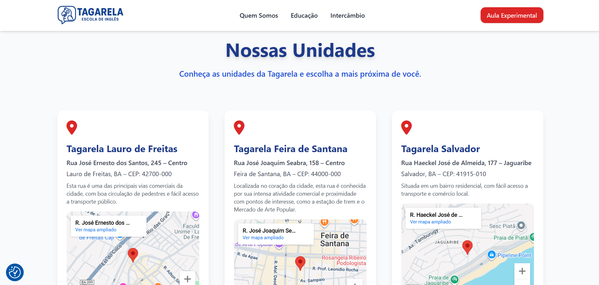
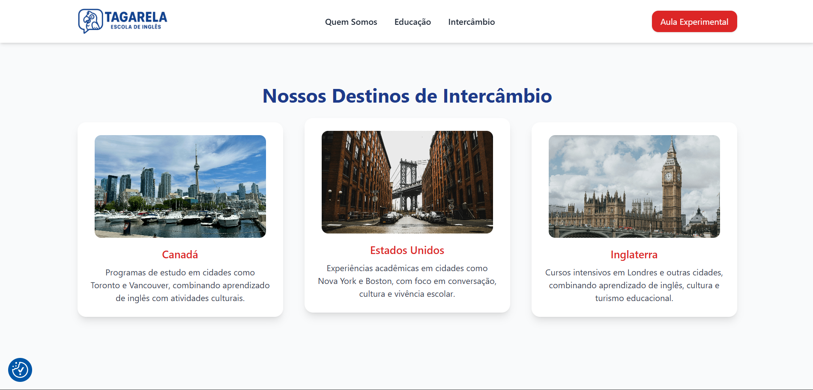
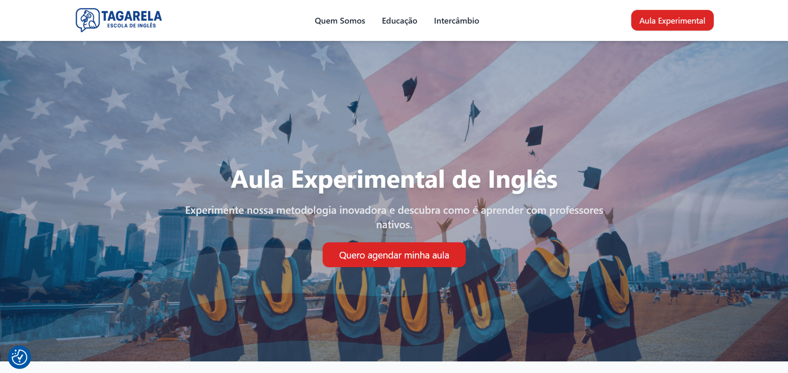
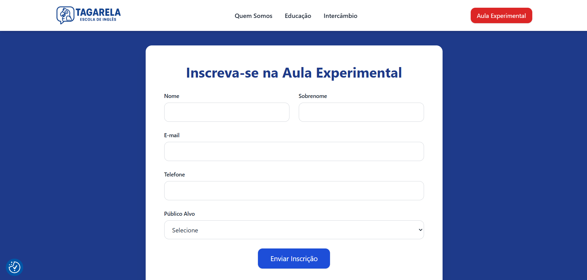
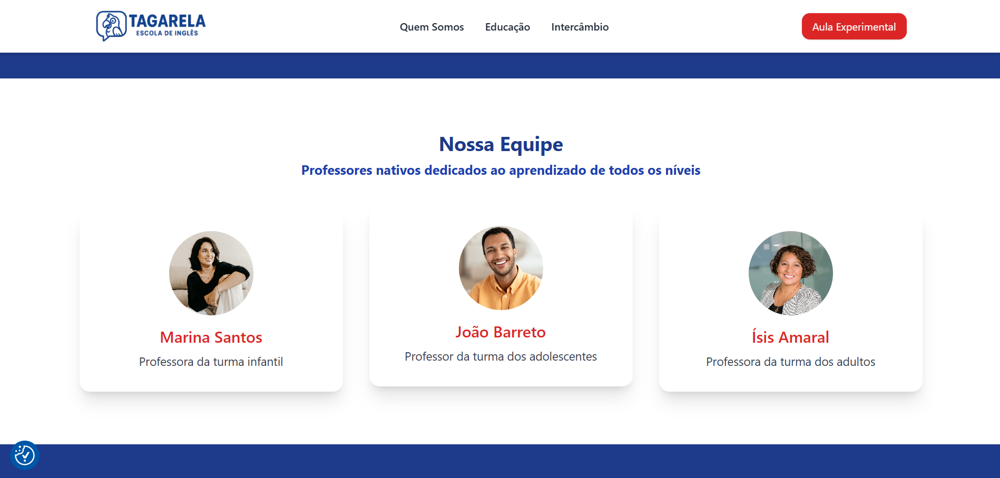

# 🎓 Escola Tagarela – Tema WordPress  

**Status do Projeto:** Finalizado 🚧  

Este repositório contém o tema **Tagarela**, desenvolvido como projeto universitário para a disciplina de **Desenvolvimento com CMS**.  
O site foi criado para uma escola de idiomas fictícia localizada em **Lauro de Freitas, Salvador e Feira de Santana**, oferecendo aulas presenciais de inglês para **crianças, adolescentes e adultos**.  

O tema foi desenvolvido **do zero**, utilizando **HTML, CSS e TailwindCSS**, com foco em:  
✅ **Responsividade completa** – adaptação perfeita para desktop, tablet e mobile  
✅ **Boas práticas de SEO** – maior performance e relevância em buscadores  
✅ **Organização de código** – facilitando manutenção e evolução futura  

---

## 📌 Estrutura do Site  

O site conta com as seguintes páginas principais:  
- **Home** – visão geral da escola e principais chamadas  
- **Localizações** – mapa com unidades em Lauro de Freitas, Salvador e Feira de Santana  
- **Alunos por idade** – seções dedicadas a crianças, adolescentes e adultos  
- **Intercâmbio** – informações sobre programas e oportunidades  
- **Quem Somos** – história, valores e proposta da Escola Tagarela  
- **Aula Experimental** – formulário para agendamento online  

---

## Prévia Visual  

### Hero (Desktop / Mobile)  
  
  

### Sessão Idades  
  

### Localizações  
  

### Intercambio  
 

### Aula experimental  
  
  

### Quem somos
  

---

## ⚙️ Tecnologias Utilizadas  

- **WordPress** – CMS base  
- **HTML, CSS e TailwindCSS** – criação do tema responsivo  
- **Font Awesome** – ícones visuais  

---

## 🔌 Plugins Adotados  

- **ACF (Advanced Custom Fields):** tornar o tema editável  
- **Yoast SEO:** otimização de buscas e boas práticas de SEO  
- **CookieYes:** gerenciamento de cookies e LGPD  
- **WP Mail** e **Contact Form 7:** disparo e gerenciamento de formulários  

---

## Objetivo do Projeto  

Esse projeto foi desenvolvido com o propósito de **aplicar conceitos práticos de CMS, SEO, responsividade e usabilidade** dentro do ambiente acadêmico.  
Além disso, buscou simular um caso real de desenvolvimento para uma instituição de ensino, integrando **design, performance e funcionalidades**.  
